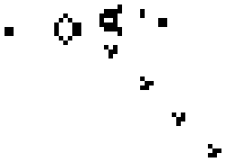

# PA1 Paralel Alghorhitms
### [FIELD OF STUDY at university]

## Getting Started

Link on subject: NA

In this project I've elaborated tasks from lessons. There is  3x implementation of GAME OF LIFE (parallel) in different programming languages.
1. C#
2. C++
3. TS (Typescript) 

Project conttains only source fiels. Need to run node.js + typescript for typescript.

## Authors

* **Adrián Mindek** -  [Surzo18](https://github.com/surzo18)

## License

Free for non-commercial use only.

